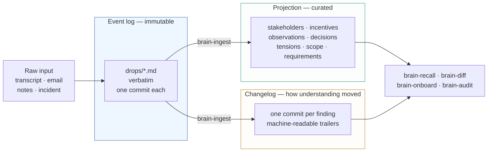
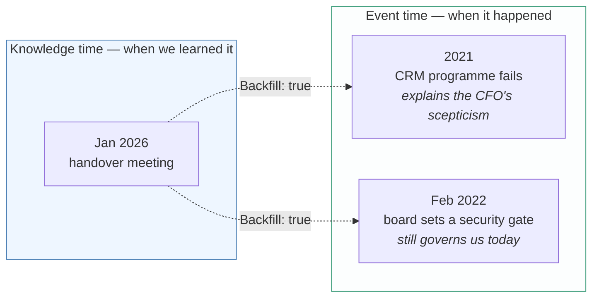
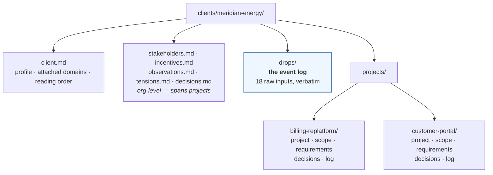
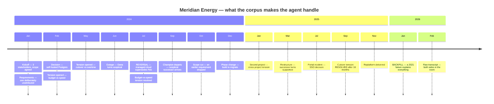

# Client Brain 🧠

**A durable, time-travelable understanding of each client — built the way a
great consultant builds it in their head, but living in files under git so it
survives beyond any employee.**

Consultants differentiate by carrying a map of the client org: who's who, what
each stakeholder actually wants, which decisions were made (and reversed),
where scope moved, where the tensions are. That map usually walks out the door
with the person. This repo captures it instead:

- **Event log** — every raw input (Fathom/Gemini transcript, email, incident
  report, dictated notes) is saved verbatim and immutably under
  `clients/<slug>/drops/`.
- **Projections** — agent skills extract *attributed findings* into curated
  Markdown (stakeholders, incentives, observations, requirements, decisions,
  tensions, scope). An hour of transcript is ~9,000 words and typically yields
  one decision plus a handful of durable notes — so the curated view stays
  small enough to read while the log grows without bound. `tools/stats.ts`
  measures the ratio for a real client.
- **Changelog** — every finding is its own git commit with machine-parseable
  trailers. `git log` *is* the story of how understanding evolved; diffs show
  changes in thinking, not just changes in text.
- **Two clocks** — understanding arrives out of order. When today's meeting
  explains why IT has been wary since a failed 2021 migration, that lands in
  the brain dated **2021** (when it happened), sourced to today's drop (when we
  learned it). Backfilled backstory is first-class current context, not a
  git-history footnote — `tools/timeline.ts` reads the story in event order,
  `tools/query-log.ts` in the order we learned it.
- **Topics** — findings are tagged against a thin controlled spine
  (`facet:term`, e.g. `component:coverage`) with free-form slugs for whatever it
  doesn't cover yet. `tools/spine.ts candidates` surfaces recurring free-form
  topics so the vocabulary grows from real usage instead of being designed up
  front. Domain packs live in `domains/` and are swappable — insurance ships as
  the first one.
- **Quality** — a synthetic corpus with golden facts and an eval harness keep
  the extraction skills honest and catch regressions when prompts change.

## How it works

Raw material goes in once and is never touched again. Everything else is
derived from it — which is why the brain can be rebuilt, and why nothing is
ever lost by curating it.



**The two clocks.** A drop's date is when the meeting happened; an entity's date
is when the *thing* happened. Those come apart the moment someone explains
history — and backfilled context is live context, not a footnote:



## Anatomy of a brain

Org-level facts sit at the root because people outlive projects; delivery facts
live per project. Only `drops/` is source truth — everything beside it is a
projection of it.



## Install (macOS + Linux)

| Dependency | macOS | Linux | Why |
| --- | --- | --- | --- |
| git ≥ 2.40 | `brew install git` | `apt-get install git` / `dnf install git` | commit trailers = the event stream |
| ripgrep | `brew install ripgrep` | `apt-get install ripgrep` / `dnf install ripgrep` | fast search over drops & brains |
| Node ≥ 20 | `nvm use` (see `.nvmrc`) | `nvm use` (see `.nvmrc`) | tools + eval harness |

Or just:

```bash
./setup.sh          # installs the above (brew | apt/dnf) + npm install
```

**Setting this up for the first time?** Follow [`INIT.md`](INIT.md) — it walks
from a fresh clone through verification to the first committed eval baseline.

## Use it (inside Claude Code)

Open this repo in Claude Code. The skills load automatically:

1. Mention a new client → **brain-init** scaffolds `clients/<slug>/`.
2. Paste a Fathom/Gemini transcript, an email, or just talk through a meeting →
   **brain-ingest** saves the raw drop, extracts findings, commits each one.
   Speaker labels resolve to people via stakeholder `aliases`
   (`tools/speakers.ts` flags any it can't map); your own team is recorded
   `side: us` and kept out of the client map; and the "good to know" a meeting
   throws off — budget rhythms, who has history with whom, what persuades a
   given exec — lands in `observations.md` instead of being lost as chatter.
3. Ask "what's the lay of the land at Acme?" → **brain-recall**.
4. Ask "what changed since March?" → **brain-diff**.
5. "Read me into this client" → **brain-onboard** (the 30-minute newcomer path).
6. Periodic hygiene → **brain-audit** (stale facts, broken chains, unlogged
   contradictions).

A new client starts with **capability but no context** — understanding grows
drop by drop, and every step of that growth is a commit you can revisit.

## Quality: evals

The extraction skills are graded, not vibes-checked. `eval/corpus/` contains a
fictional client — **Meridian Energy**, a utility, 18 drops across two simulated
years — authored so every expected fact is objectively identifiable, wrapped in
realistic noise including red herrings that must *not* become findings.

The storyline is chosen to exercise exactly the things a naive summariser gets
wrong: a decision reversed months later, a champion leaving, an outage that
flips someone's disposition, a deadlock that stays open for sixteen months, and
history arriving two years late.



The harness replays these drops through the real ingest skill in a hermetic
sandbox and grades the resulting brain + git log:

```bash
npx vitest run --project unit       # tool tests — no API key needed
npx vitest run --project corpus     # corpus integrity + GRADER SELF-TEST — no API key
cp .env.example .env                # set ANTHROPIC_API_KEY, then:
npm run eval -- --smoke             # cheap check: 3 drops on haiku, no judge
npm run eval -- --drops all --judge on --baseline   # full baseline
npm run eval -- --drops 7 --stale-ok                # re-run one drop from cache
npx tsx eval/src/recall.ts          # question-answering eval vs after-16 state
npx vitest run --project scores     # regression gate against metric floors
```

The grader self-test replays a scripted *perfect* ingest and requires every
metric to score 1.0 — plus negative cases proving each metric catches its
failure mode — so the graders themselves are under test without an API key.

Baseline reports land in `eval/reports/` with per-metric scores (fact recall,
precision, attribution, supersession, commit-protocol compliance), cost, a
delta vs the previous baseline, and a per-failure appendix — so skill-prompt
changes show their score delta. See `eval/reports/README.md` for the baseline
procedure (none committed yet; it's a one-command local run).

## Derived layers (optional, always rebuildable)

Files + git are the only source of truth. Everything else is a disposable
projection you can rebuild from `drops/`:

- **Search now:** `npx tsx tools/search.ts` (ripgrep-backed).
- **Vector search later:** `tools/index.ts` documents the contract for a local
  embedded index (sqlite-vec / LanceDB) under `.cache/` — deliberately not
  built yet.
- **Obsidian:** any `clients/<slug>/` folder opens as a valid Obsidian vault
  for humans who want graph views. `.obsidian/` is git-ignored.
- Agent-memory systems (mem0/Zep/Letta, MCP markdown-memory servers) can
  *consume* these files; they never own the data.

## Layout

```
CLAUDE.md            operating instructions for the agent
docs/PLAN.md         the full build plan & design rationale
docs/TODO.md         backlog — led by validating all of this against real transcripts
schema/              SCHEMA.md (entities, IDs) · FINDINGS.md (commit protocol) · templates/
.claude/skills/      brain-init · brain-ingest · brain-recall · brain-diff · brain-audit · brain-onboard
domains/             domain packs — the thin controlled vocabulary for topics
tools/               validate · query-log · timeline · staleness · search · speakers · stats · spine · commit-finding.sh
clients/             one brain per client (ships empty)
eval/                corpus · goldens · harness · committed score reports
```
